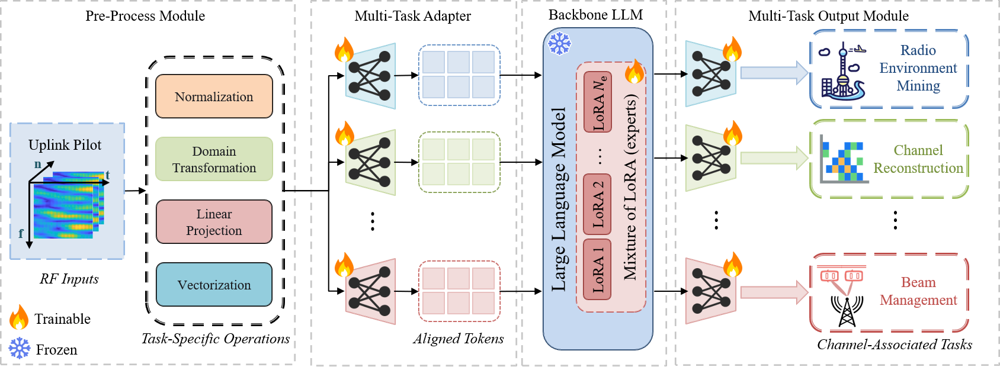

# LLM4WM: Adapting LLM for Wireless Multi-Tasking
Liu, Xuanyu, et al. "LLM4WM: Adapting LLM for Wireless Multi-Tasking." arXiv preprint arXiv:2501.12983 (2025). [[paper]](https://arxiv.org/pdf/2501.12983)
<br>

<p align="center">

<p>

## Dependencies and Installation
- Python 3.8 (Recommend to use [Anaconda](https://www.anaconda.com/))
- Pytorch 2.0.0
- NVIDIA GPU + CUDA
- Python packages: `pip install -r requirements.txt`


## Dataset Preparation
The test datasets used in this paper is generated by [QuaDRiGa](https://quadriga-channel-model.de/), and it can be downloaded in the following links.
[[Testing Dataset]](https://pan.baidu.com/s/1b_7N_2L_9ujZzuc9w94rkA?pwd=PCNI)


## Get Started

### Step 1: Prepare the Files

- **Dataset**: Download the dataset and place it under the `data/` folder in the root directory.
- **GPT-2 Weights**: Download the [GPT-2](https://huggingface.co/openai-community/gpt2) weights and put them into the `pretrain/` folder.
- **LLM4WM Weights**: Download our provided pretrained weights of [LLM4WM](https://pan.baidu.com/s/1EzsCD4GAr63HQDVB2-_XzA?pwd=PCNI) and store them in the `Weights/` folder.

### Step 2: Run Inference

Once all the required files are in place, you can evaluate our pretrained model with:

```bash
python inference.py
```

## Citation
If you find this repo helpful, please cite our paper.
```latex
@article{liu2025llm4wm,
  title={LLM4WM: Adapting LLM for Wireless Multi-Tasking},
  author={Liu, Xuanyu and Gao, Shijian and Liu, Boxun and Cheng, Xiang and Yang, Liuqing},
  journal={arXiv preprint arXiv:2501.12983},
  year={2025}
}
```